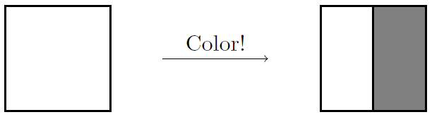
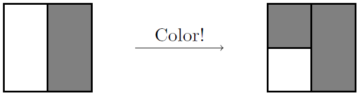

\thispagestyle{fancy}

**Name(s):** \

**Instructions:** Form a group of 3-4 people. First, write your answers individually on a separate piece of paper. Second, discuss your answers within your group. Finally, write your final answers as a group on another piece of paper. Make sure to write your group names on this worksheet and attach your solutions before you submit your final work. \

**Goal:** Derive the formula for the sum of a geometric series and explore the intuition behind this formula.

\

(1) Consider coloring in a $1 \times 1$ square using the following step-by-step process. For the first step, we draw a line vertically down the middle of the square and color the right half:

    ```{r echo=FALSE, out.width='35%', fig.align='center'}
    
    ```
    
    Since the square has area $1$, the area of the shaded region is $\frac{1}{2}$. For the next step, we draw a horizontal line through the remaining space and color in the top quarter:

    ```{r echo=FALSE, out.width='35%', fig.align='center'}
    
    ```

    At this point, the shaded region has area $\frac{1}{2} + \frac{1}{4} = \frac{3}{4}$. We continue this process, at each step coloring half of the remaining space.

    a.  i. Draw the square after three steps. What is the area of the shaded region? Write this as both an expanded sum, and as a single fraction.
  
        ii. Draw the square after four steps. What is the area of the shaded region? Write this as both an expanded sum, and as a single fraction.
      
        iii. Draw the square after five steps. What is the area of the shaded region? Write this as both an expanded sum, and as a single fraction.

    b. Now, let's think about the area after $k$ steps, where $k$ is an arbitrary number.
  
        i. Write down a sum that expresses the area after k steps. Write it in both expanded form and in sigma-notation.
      
        ii. In part a, you may have noticed a pattern in your final answers. Use this to guess a simple formula for the area after n steps (in other words, simplify so your answer is no longer a sum).
      
        iii. Based on this formula, what can you infer about the area of the shaded region as $k$ tends toward infinity? Does this make geometric sense? Why or why not?
      
\newpage

(2) The general term for the infinite geometric series is
     
     $$\sum_{n=1}^{\infty} a_1 r^{n-1} = a_1 + a_1 r + a_1 r^2 + a_1 r^3 + \cdots$$.
     
     In part a and b in problem 1, the areas that you calculated were geometric sums with a specific initial term $a_1$ and common ratio $r$.
     
     a. What is the initial term $a_1$ and the common ratio $r$ from Problem 1?
     
     b. Find the general formulas for the $k$th partial sum. Justify your formulas by writing out the steps and details.
     
     c. Suppose that $|r| < 1$, find the infinite sum of the geometric series. Justify your formulas by writing out the steps and details.
     
     d. Use the initial term $a_1$ and the common ratio $r$ from Problem 1 to compute the area of the square.

(3) For the following series, determine if the series converges or diverges, and calculate the kth partial sums and infinite sums. Your final answers must be justified with enough detailed explanations (or steps). Note that using just the formulas are not enough explanation. Please use either words or mathematical expressions to show your work.

    a.    \begin{flalign*}
        \sum_{n=1}^{\infty} 2 \cdot \left( \frac{1}{3} \right)^{n-1} &&
        \end{flalign*}

    b.    \begin{flalign*}
        \frac{1}{4} + \frac{1}{8} + \frac{1}{16} + \cdots &&
        \end{flalign*}

    c.    \begin{flalign*}
        \sum_{n=1}^{\infty} \frac{e}{\pi^{n-1}} &&
        \end{flalign*}

    d.    \begin{flalign*}
        0.9 + 0.09 + 0.009 + \cdots &&
        \end{flalign*}
  
    e.    \begin{flalign*}
        \sum_{n=1}^{10} 2 \left( \frac{2}{3} \right)^{n-1} &&
        \end{flalign*}
 
    f.    \begin{flalign*}
        \sum_{n=1}^{\infty} (-2)^{n-1} &&
        \end{flalign*}
  