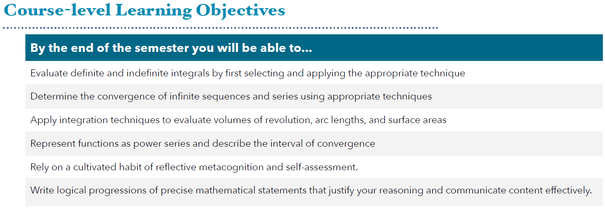
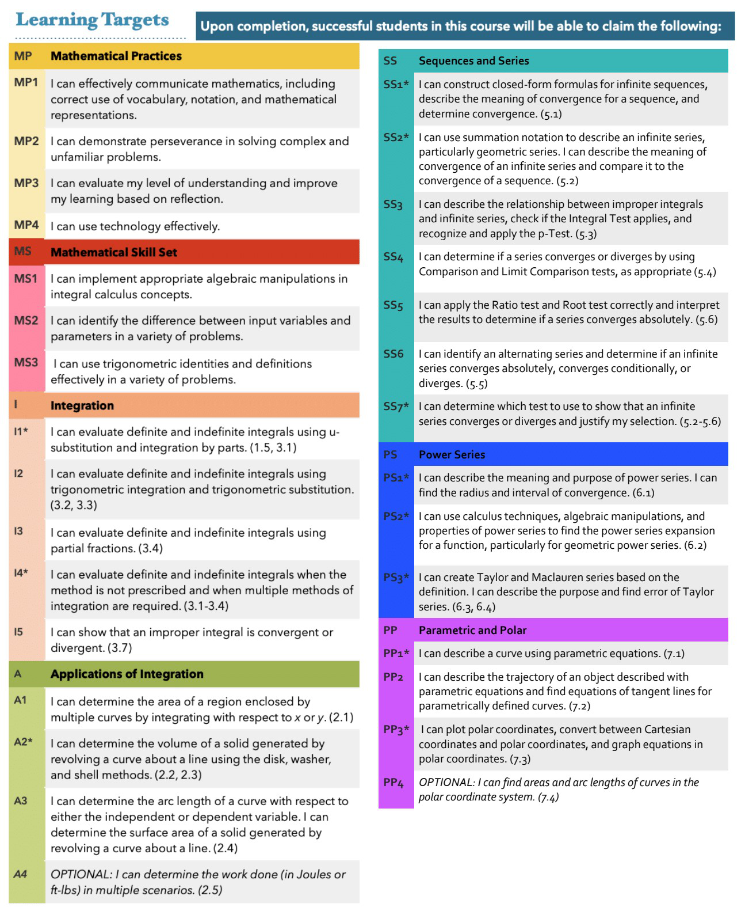
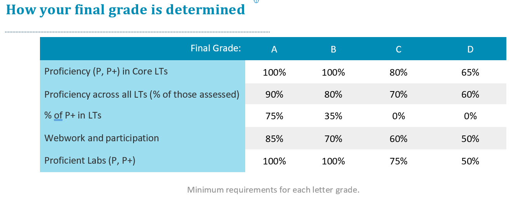

<br>

## **About the Class**

<br>

### Course Title

MTH 202A: Calculus II

<br>

### Description

Students in this course will deepen their understanding of the foundational topics in calculus, including techniques of integration, applications of integration, and infinite sequences and series, including Taylor series. Ongoing emphasis on problem solving strategies and the development of mathematical communication.

<br>

### Core Statement

The University of Portland offers a liberal arts Core Curriculum with a vision of students acquiring knowledge, skills, and values that will prepare you to respond to the needs of the world and its human family, while having a foundation of multiple lenses to address enduring questions of human concern. The University Core Curriculum strives to achieve this vision by cultivating six habits of heart and mind in all graduates regardless of major. As a priority for this Core class, our focus is the “scientific and quantitative literacy and problem solving” habit.

As part of developing that habit this course will prioritize students learning to employ mathematical and statistical skills to explore and make sense of data. Toward this end, as one specific Core learning outcome for this class, the expectation is that students who complete this course will be able to use the tools of differential calculus to solve complex problems and effectively communicate solutions in written form.

<br>

### You Belong Here

In our classroom, diversity and individual differences are respected, appreciated, and recognized as a source of strength. I support the use of mathematics as an analytic tool to challenge power, privilege, and oppression. It is our collective responsibility to create a welcoming space where ideas can be challenged while individuals are respected. I ask you to support one another as you develop as mathematicians and analytic thinkers.

<br>

### Instructor Information

  * **Instructor:** [Alex John Quijano](https://www.alexjohnquijano.com/){target="_blank"} <br>
  * **Office:** Buckley Center 279 <br>
  * **Email:** quijano@up.edu <br>

<br>

### Class Time and Location

  * **Lectures:** MWF 9:15 AM – 10:10 AM, Franz 234 <br>
  * **Discussions:** Th 9:45 AM - 10:40 AM, Franz 222 <br>
  
<br>
  
### Final Exam

  * **Final Exam:** May 4, Th 1:30 PM - 3:30 PM, Franz 234 <br>

<br>

### Help Hours

* **Alex John Quijano (Instructor)**
  * Walk-in (Buckley Center 279)
    * TuTh, 4:00 PM - 5:00 PM
  * One-to-One (Buckley Center 279 or in Teams) <br>
    [[sign-up for a 30-minute session]](https://calendly.com/alexjohnquijano/quijano-sp23-scheduled-help-hours)
      - Availability on TuTh, 11:00 AM - 4:00 PM 
      - Availability on MWF, 2:00 PM - 4:00 PM
    
<br>

### Lectures

Lectures will occur synchronously during their scheduled time.

<br>

### Prerequisites

MTH 201

<br>

### Learning Objectives

```{r echo=FALSE, out.width='100%'}

```

<br>

### Learning Outcomes

```{r echo=FALSE, out.width='85%', fig.align='center'}

```

The \* next to a learning target indicates a Core topic.

<br>

## **Academic Support**

<br>

### Getting Help

Don't hesitate to ask for assistance! I have help hours specifically in place because I want you to succeed, and the best place to connect with questions is one-on-one. If you can’t make it to my posted help hours, let me know and we can find another time. Other help options include:

  * Post your question to the class Teams Question-Answering channel
  * Get together with classmates to study together
  * Drop by the Math Resource Center, which offers both drop-in and appointment-based tutoring.
  * Google it. If you find a resource helpful, let me know.

I understand that life happens, and illness, depression, family, relationships can disrupt our lives. When something arises, REACH OUT! I want to be able to support you in this course, and can only do so if you let me know.

<br>

### Collaboration Policy

I expect you to participate in the class through lectures, discussion, labs, and other engagements. I also expect you to make use of opportunities to get help outside of class (help hours, Teams, email, tutoring) if you need help. Concise and specific messages are the most helpful so I know how I can best help you.

Students are encouraged to participate in discussions with their peers (or each other) regarding homework and other assignments. However, each student must take responsibility and ownership of their work and submit their work individually.

<br>

### Help Hours Guidelines

It is strongly recommended that you attend the walk-in help hours or set up a one-to-one meeting with the me if you feel like you are falling behind during our in-person class activities, or if you just need to clarify concepts discussed in class. In order to be more productive during a one-to-one meeting (or the walk-in help hours), these are three recommendations before you come in:

  * List all gaps in knowledge you have (missed concepts) or list all concepts that were unclear to you during class. We will address them one by one.
  * Prepare questions you want answered and be ready to show relevant materials.
  * Regarding assignments, prepare to show (a) what are the steps you have tried and (b) what are the errors you encountered and the strategies you have tried.

Note that these are recommendations so that you can get the most out of the help hours allocated for you. If you just want to come in and chat about something else, feel free to do so. If the dedicated time for one-to-one meeting does not work for you, send me a message to set up an appointment.

<br>

### The Learning Commons

Students can get academic assistance through Learning Commons tutoring services and workshops. The Co-Pilot peer tutoring program provides students with opportunities to work with other students to get help in writing, math, group projects, and other courses. Students can schedule an appointment to meet with a Co-Pilot (tutor) or they can also meet with a Co-Pilot during drop-in hours. Check the [Learning Commons](https://www.up.edu/learningcommons/index.html) website for more information. Find a tutor at the Learning Commons to get support on your academic journey.

<br>

### Math Resource Center

Appointment-based tutoring starts week 1. Drop-in tutoring is Mon-Thurs, 3:00 PM - 6:30 PM in BC 163 and starts week 2. Visit the [Math Resource Center](https://www.up.edu/learningcommons/math-resource-center/index.html){target="_blank"} website with more info.

<br>

### Accessibility Statement

The University of Portland endeavors to make its courses and services fully accessible to all students. Students are encouraged to discuss with their instructors what might be most helpful in enabling them to meet the learning goals of the course. Students who experience a disability are also encouraged to use the services of the Office for Accessible Education Services (AES), located in the Shepard Academic Resource Center (503-943-8985). If you have an AES Accommodation Plan, you should make an appointment to meet with your faculty member to discuss how to implement your plan in this class. Requests for alternate location for exams and/or extended exam time should, where possible, be made two weeks in advance of an exam, and must be made at least one week in advance of an exam. Also, if applicable, you should meet with your faculty member to discuss emergency medical information or how best to ensure your safe evacuation from the building in case of fire or other emergency.

<br>

## **Class Materials and Resources**

<br>

### Class Website

The syllabus, tentative topics schedule, lecture slides, assignments, and all other class materials are posted on the [course website](https://upmathematics.github.io/mth-202a-sp23/) - the website can be viewed in Teams.

<br>

### Assignments

  * **Homework:** For most sections, you will be required to complete an online homework via WeBWork. Homework is due Monday, Wednesday, or Friday due 24-72 hours after it was posted. Homework is graded automatically. It is strongly suggested that you do your homework regularly; it's best done following class, when it is fresh in your mind. Most questions allow unlimited attempts and there is no penalty for incorrect answers. If you find yourself stuck on a problem after many attempts, please reach out for additional help!
  
  * **Proficiency Quizzes:** Weekly proficiency quizzes provide opportunities to demonstrate your understanding of the course learning targets. Each quiz will include 2-3 learning targets as well as the option to reassess past targets. Proficiency should be attained twice for each *core* learning target. Most Quizzes are written and submitted in-person. Quizzes are conducted in class. Some quizzes can have specific notes open and some quizzes are closed notes. Electronic devices with or without access to the internet is not allowed. Quizzes must be submitted at the end of class.
  
  * **Labs:** Semi-weekly labs will be due on Wednesdays at end-of-day. Lab problems should be either typed or written and submitted as a pdf file in Teams Assignments. These labs are part of the Core Assessment, and will have common grading across all MTH 202 sections. Labs will be graded on three components:
    - *Validity:* Is the method correct? Is the final solution correct?
    - *Explanation:* Is the solution method well explained? Is the reasonableness of the solution justified?
    - *Representation:* Is the solution process clearly written? Is the solution supported with appropriate graphs/diagrams/equations? Is mathematical notation used clearly and correctly?

    Labs can be hand-written or typed, but must be uploaded as a single pdf file. Late labs will be lowered one grade scale. If you had handwritten your answers/solutions on a physical paper, make sure to label it properly and please scan your document using a scanner app for convenience. Suggestions: (1) "Tiny Scanner" for Android or (2) "Scanner App" for iOS. 
    
    To submit lab revisions, students must complete the following for each problem you missed:
        
    * An explanation of the errors you made (A algebra? Graphs? Is there a specific concept?)
    * Resolve the problem: be sure to include a clear explanation of your solution process so that another student in the class will understand
    * Identify or create three difficult problems from this unit. (You can find/modify problems from in-class activities, webwork, the textbook, etc.) Solve each of the problems correctly, clearly describing your steps.
    * Create a single PDF that includes (1) the previous lab, (2) the lab corrections, and (3) the additional practice problems.

    Revised labs can earn up to a score one point higher than the original score (thus a “Not yet proficient” lab can be revised into a “Proficient” lab.)
  
  * **Final Exam:** The final exam includes two components: a written assessment of the big mathematical ideas of the course. This assessment will be cumulative: it will focus on connections between ideas, conceptual understanding of the material, and applications rather than nitty-gritty computations. The second half of the final exam time will allow for reassessment of past learning objectives.

<br>

### Textbook

The main textbook is [Calculus Volume 2 ](https://openstax.org/details/calculus-volume-2){target="_blank"} by Gilbert Strang, Edwin “Jed” Herman et. al. The textbook is free and open-source.

<br>

### Graphing Calculator

We will be using Desmos as our online graphing calculator. Use your UP email to sign-up for a free Desmos account and join our Desmos class [MTH-202A: Calculus II Spring 2023 [Quijano]](https://student.desmos.com/?prepopulateCode=yrx8n9){target="_blank"}. If you need the Desmos class code, use **YRX8N9**.

<br>

### WeBWork

We will be using WeBWork for homework assignments. You are already on WeBWork. So, you just need to log in using your UP credentials at [MTH202-Quijano-S23](https://webwork.up.edu/webwork2/MTH202A-S23/){target="_blank"}.

<br>

### Microsoft Teams

We will be using Teams [mth-202a-sp23](https://teams.microsoft.com/l/team/19%3allIZY2hHKzLKeQbjL4XqrpzF6RCPXZ-VhsSTxIrrb1s1%40thread.tacv2/conversations?groupId=c326c2dc-6c52-4f13-b437-ef74df91b4f3&tenantId=ea8f3949-231c-40b6-a33f-56873af96f87){target="_blank"} as the main real-time communication tool for general announcements, assignment submissions, question-answering discussions, and direct messages. I added you to the Teams page already, so you just need to log in using your UP credentials. If not, then send a request when you log in. Let me know if you need any assistance. If you need the Teams code for this class, use **r5r6mis**.

Please check the class Teams regularly. If you need to have Teams notifications sent to your email, please set up your email preferences within Teams.

If you prefer communicating through email, note that I have set up an email filter for this course, and you must put the “MTH 202” keyword in your subject line. It is easy for me to get notice of your email if you put the keyword in the subject line. Concise and specific messages are helpful, so I know how I can best help you.

<br>

## **Class Assessment**

This course is guided by the philosophy that learning mathematics requires focused effort, reflection, and revision. Assessment of this course is based on a proficiency system, in which students have multiple attempts to demonstrate proficiency, with opportunities to reflect on and improve previous understanding.

<br>

### Assessment Disclosure Statement

Student work products for this course may be used by the University for educational quality assurance purposes.

<br>

### Attendance and Participation

You are expected to actively participate in this classroom community. Participation includes coming to class on time, being prepared, being willing to ask questions and share ideas, setting up study groups outside of class, attending tutoring sessions, posting helpful resources online, and contributing to the Teams discussion channels. Exit cards will be assigned regularly at the conclusion of class as part of participation assessment. Group and individual presentations of ideas is a required component of participation. We will cover new course material on Monday, Wednesday, and Friday. Most Thursday class times will be for small group work on labs and for proficiency assessment.

<br>

### Grading

```{r echo=FALSE, out.width='100%'}
knitr::include_graphics('images/mth-202-assessment-standards.png')
```

  Labs will be graded on completeness, validity of the mathematics, the clarity of the explanations, and the quality of the use of representations to illustrate the mathematics based on the rubric. Please see table below.

  Quizzes will be graded similarly as the labs.

|                                                                                                                                            | **1: Incomplete**                              | **2: Not yet proficient**                                                                      | **3: Proficient**                                                                                                        | **4: Highly proficient**                                                                                     |
|--------------------------------------------------------------------------------------------------------------------------------------------|------------------------------------------------|------------------------------------------------------------------------------------------------|--------------------------------------------------------------------------------------------------------------------------|--------------------------------------------------------------------------------------------------------------|
| **Completeness**                                                                                                                           |    <br>No work/minimal work                    |    <br>Most problems attempted, some complete solutions                                        |    <br>Most problems completed with full solutions and all problems attempted<br>   <br>All problems clearly labeled.    |    <br>All problems completed with full solution. All problems clearly labeled.                              |
| **Validity: Is the mathematics correct?**                                                                                                  |    <br>No or minimal correct mathematics       |    <br>Contains one or more conceptual errors or several minor errors.                         |    <br>May contain a few minor errors but no big conceptual errors. Good use of mathematical language and symbols        |    <br>All parts of all problems mathematically valid: strong use of mathematical language and symbols       |
| **Representations: (Numbers, Symbols, Diagrams, Graphs, Words)**                                                                           |    <br>No or minimal use of representations    |    <br>Multiple representations present, but may not capture the mathematics clearly           |    <br>Multiple representations used appropriately                                                                       |    <br>Multiple representations are used when appropriate with clear links connecting the representations    |
| **Explanations and alternate solution methods: Are the explanations clear and logical? Are multiple ways to solve the problem presented?** |    <br>No or minimal explanation               |    <br>Explanations present, but incomplete or confusing. Alternate strategies are minimal.    |    <br>Strong explanations for most problems. Alternate solution strategies included when needed                         |    <br>Strong explanations for every problem. Multiple solution paths included for some problems             |

<br>

### Final Grades

```{r echo=FALSE, out.width='100%'}

```

Note that these percentages are guidelines more than hard and fast rules. I will consider the entire body of your work when making these determinations, and this will also be informed by your own self-assessments. I will never impose standards higher than those outlined in the table but reserve the right to round down the needed minimum percentages (in a way that favors you).

Decisions about +/- cutoffs will be based on (a) your performance on the final assessment and (b) your achievements as a whole.

<br>

### Revisiting Your Work

Much of your work in this class can be revised. Everyone's path to understanding is different but we all benefit from reflecting on our mistakes. Since much of the mathematical content will build on previous ideas, however, reflecting in a timely way is important (hence a one-week deadline).

In addition to the regular in-class quizzes, you may re-assess any of the Learning Targets that we’ve covered through any either of the following methods:
  
  * On quiz days there is additional time to retake additional Learning Target quizzes.
  *  You may schedule a retake on a particular Learning Target to be done during Help Hours in my office. This retake can be arranged to be done via conversation rather than
written form.
  * The final exam will be used for additional Learning Target retakes. University policy requires that students take the final exam at the time determined by the registrar. 
  
There are some restrictions on re-assessing using these methods:
  
  * Reassessments must be completed within 4 weeks of the first scheduled assessment.
  * A reassessment application must be submitted via email at least 24 hours in advance of the reassessment time.
  * Reassessment applications must include the name of the learning target and a copy of written corrections from the previous quiz.
  * You may not do more than one re-assessment per learning target outside of class per week.
  * No re-assessments will be given during finals week other than during the final exam time.

*Oral Exams:* At any time, students may be requested to complete an oral exam to explain or clarify their written work on labs or proficiency assessments. Such oral exams can impact a students’ grade on the given assessment.

<br>

### Late Assignments and Incompletes

You are expected to turn in all completed assignments on time. Circumstances that may disallow you to turn in your work on time – such as a medical reason – are understandable. Please let the instructor know if you are unable to submit your work and have missed the deadline way beyond its original posted date. Because every assignment is an important aspect of your learning in this class, we will discuss when you will turn in the assignment as well as decide upon an acceptable consequence for your turning it in late. I am committed to successfully helping you learn from this course.

<br>

## **Class Expectations**

<br>

### Classroom Norms

  * Follow assignment submission guidelines.
  
  * Give your undivided attention to the class discussions. 
  
  * If you don’t agree with what someone else has to say, you are encouraged to express your point of view, but do so respectfully, and support your claims with textual evidence.
  
  * Everyone has the right to be heard. Maintain confidentiality if a person decides to share a personal experience.

  * No name calling and respect each person's identity.

  * One person speaks at a time. Give chances for other people to speak.
  
  * Maintain the highest standards of excellence for both you and others.

  * Possess the humility to understand that you are not an expert in everything and that everyone has room for improvement.

  * Realize that each person will start with a distinct set of skills.
  
  * Take care of yourself. If you need to step out of the classroom to have a moment to yourself - or go the bathroom - feel free to do so.

<br>

### Non-Violence Statement

The University of Portland is committed to fostering a community free from all forms of violence in which all members feel safe and respected. Violence of any kind, and in particular acts of power-based personal violence, are inconsistent with our mission. Together, we take a stand against violence. Join us in learning more about campus and community resources, UP’s prevention strategy, and reporting options on the Green Dot website, [www.up.edu/greendot](www.up.edu/greendot){target="_blank"} or the Title IX website, [www.up.edu/titleix](www.up.edu/titleix){target="_blank"}.

<br>

### Academic Honor Principle

Academic integrity is openness and honesty in all scholarly endeavors. The University of Portland is a scholarly community dedicated to the discovery, investigation, and dissemination of truth, and to the development of the whole person. Membership in this community is a privilege, requiring each person to practice academic integrity at its highest level, while expecting and promoting the same in others. Breaches of academic integrity will not be tolerated and will be addressed by the community with all due gravity.

In your written work, follow the conventions of an appropriate citation using the APA, MLA, CSE, or SIAM styles. Please consult with the instructor - or [Clark Library Research Guides](https://libguides.up.edu/guides/gethelp) if you have questions about proper citations.

<br>

### Inclusion and Diversity

The natural and mathematical sciences are often viewed as objective disciplines. Science is a method for us to understand how the world works. However, it is historically built from a small set of privileged populations that often ignores the biases. I acknowledge that there may be some parts in this course that have overt and covert biases. Science is a human endeavor, and the pursuit of knowledge and skill must incorporate a diverse set of experiences. 

I value all students regardless of their background, country of origin, race, religion, ethnicity, sexual orientation, disability status, etc. I am are committed to providing a climate of excellence and inclusiveness within all aspects of this course. If you have any concerns, issues, or challenges, you are encouraged to discuss with the instructor (set up a meeting by email or a direct message in Teams) with the assurance of full confidentiality except for academic integrity code violations or sexual harassment (which I am obligated by law to report).

<br>

### Mental Health Statement

As a college student, you may sometimes experience problems with your mental health that interfere with academic experiences and negatively impact daily life. If you or someone you know experiences mental health challenges at UP, please contact the University of Portland Health and Counseling Center in Orrico Hall (down the hill from Franz Hall and near Mehling Hall) at 503-943-7134 or hcc@up.edu. Their services are free and confidential, and if necessary they can provide same day appointments. In addition, phone counseling is available by calling 503-943-7134 and pressing 3. The University of Portland Campus Safety Department (503-943-4444) also has personnel trained to respond sensitively to mental health emergencies at all hours. Remember that getting help is a smart and courageous thing to do – for yourself, for those you care about, and for those who care about you.

<br>

### COVID-19 Related Statements

Generally, students are expected to attend all class sessions according to the instructor’s direction. Students who feel unwell or have a temperature above 100 degrees should NOT attend class in person. These students should inform their instructor as soon as possible. 

Students who must be in isolation due to COVID-19 symptoms or a positive test should also contact their instructor as soon as possible to work out details for keeping up with the course material while in isolation. 

Should the instructor test positive for COVID-19, even without symptoms, the course will be temporarily conducted remotely. Should the instructor be unable to teach for an extended period of time, the respective department or unit will find a substitute to continue the course. 

Following current guidance from our county and state health authorities, face coverings are highly recommended in the classroom and all indoor spaces. As we move through the semester, however, classroom rules and procedures may change. All students and instructors must follow any University-wide COVID-19 rules and procedures that might be in put place at any given time during the semester for classrooms, labs, and all common areas of academic buildings. Such rules and procedures may include required face coverings, suggested distancing protocols and directions, and limitations on eating and drinking in the classroom, among other things. Failure to follow any of the COVID-19 classroom rules in place at the time could result in a student’s removal from the course and/or a report filed with the Office of Student Conduct.

<br>

### Ethics of Information

The University of Portland is a community dedicated to the investigation and discovery of processes for thinking ethically and encouraging the development of ethical reasoning in the formation of the whole person. Using information ethically, as an element in open and honest scholarly endeavors, involves moral reasoning to determine the right way to access, create, distribute, and employ information including: considerations of intellectual property rights, fair use, information bias, censorship, and privacy. More information can be found in the Clark Library’s guide to the Ethical Use of Information at [libguides.up.edu/ethicaluse](libguides.up.edu/ethicaluse){target="_blank"}.

<br>
